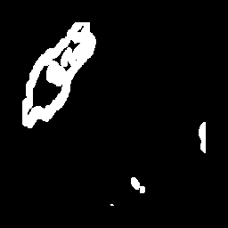
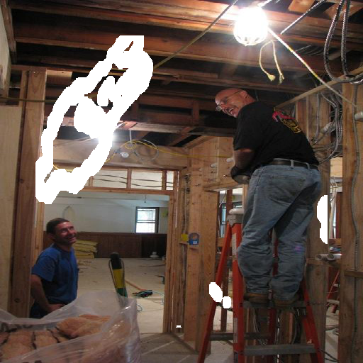
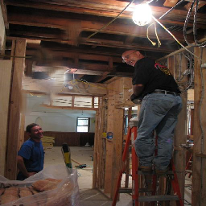
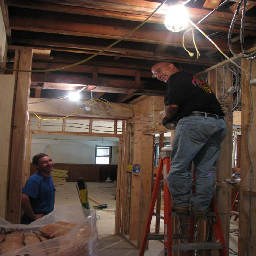

# PatchMatch for inpainting

      

## Introduction

This repository borrow most of the code from [younesse-cv](https://github.com/younesse-cv/PatchMatch).  However that repository is C style, which cannot be compiled using `opencv 3.x`.  What I did is wrapping the code using `opencv 3.x` API in C++ style.


## Dependencies

- cmake > 2.8
- opencv 3.x
- g++-5


## How to use

- Download this repository

  ```bash
  git clone https://github.com/ZQPei/patchmatch_inpainting.git
  ```

- Compile

  ```bash
  mkdir build
  cd build
  cmake ..
  make
  cd ..
  ```

- Run

  ```bash
  ./build/main
  ```


## Demo

| mask                                                  | masked image                                                 |
| ----------------------------------------------------- | ------------------------------------------------------------ |
|      |  |
| **inpainting image using PatchMatch**                 | **origin image**                                             |
|  |           |


## References

https://github.com/younesse-cv/PatchMatch

